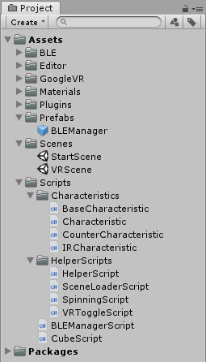
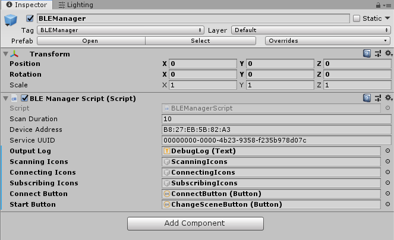
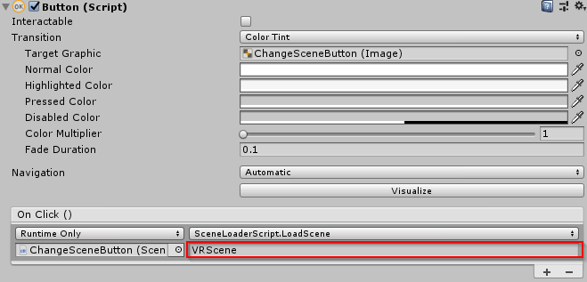
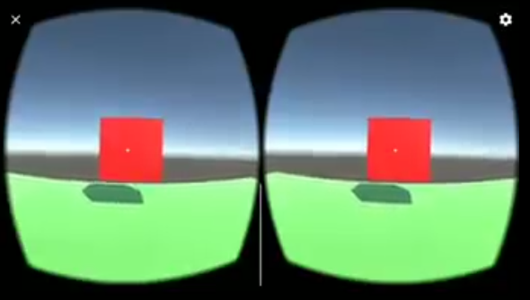

This page contains information about including the framework within your own Unity  projects.

## Requirements
Component | Description |
--- | --- 
Compatible Smartphone | Smartphone which has support for Bluetooth Low Energy
BLE Unity Asset Plugin | As already mentioned, this is mandatory! We will not provide you with the needed files. Therefore, please support the author and purchase his asset on the Unity Asset Store ([Link](https://assetstore.unity.com/packages/tools/network/bluetooth-le-for-ios-tvos-and-android-26661))
Google VR SDK | Follow the official documentation for setting up Unity for developing with the Google VR SDK ([Link](https://developers.google.com/vr/develop/unity/get-started-android))

## Set Up
1. Start a new Unity project (Unity Version 2018.3.12f1)
2. Import the BikeVR-Framework package (Assets > Import Package > Custom Package... > Select BikeVR-Framework.unitypackage)
3. Follow the official documentation for setting up Unity for developing with the Google VR SDK and import the Google VR SDK package
4. Open up the Asset Store in the Unity Editor and import the BLE Unity asset from there (Click Account > My Assets > Import)
5. Your Project folder should look similar to this:

    

6. Open the StartScene (Scenes/StartScene) and make sure that every value of the BLE Manager Script is set correctly:

    

7. (Optional) Feel free to edit the StartScene  or make any changes you deem necessary.
8. Use the VRScene or create a new one to create your own VR application (make sure to edit the ChangeSceneButton attribute in case you create a new scene)

    

    

Refer to the [framework's documentation page](unity-framework.md) for more information about how to properly use it.