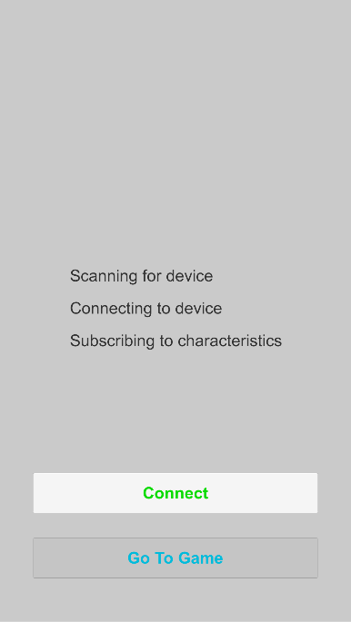

This page contains information about the Unity Framework in order to use an Android or iOS smartphone to act as a BLE central in order to read the advertised values of the sensor-controller.

`Disclaimer`: All development and testing has been done using the Unity Version 2018.3.12f1

`Disclaimer`: Our framework heavily relies on the work of SHATALMIC's BLE Unity asset plugin ([Link](https://assetstore.unity.com/packages/tools/network/bluetooth-le-for-ios-tvos-and-android-26661)). It is therefore mandatory to purchase this asset in advance in case you want to make changes on your own (Please support the author for his amazing work).

## Software Components
Component | Description | Link
--- | --- | ---
GitHub Repo | Source code of Framework | <https://github.com/dangpg/BikeVR-Unity-Framework>
BLE Unity Asset Plugin | Plugin responsible for calling native Bluetooth methods | <https://assetstore.unity.com/packages/tools/network/bluetooth-le-for-ios-tvos-and-android-26661>

## Connect to Sensor Controller
The scene `StartScene` demonstrates a simple GUI scene in order to connect the smartphone with the sensor controller and can be used as a starting scene before the VR scene gets displayed.

The `BLEManager` gameobject holds the `BLEManagerScript` and is therefore responsible for managing the Bluetooth connection to the sensor controller.
This gameobject does not get destroyed when changing scenes.

Attributes of `BLEManagerScript`:

Attribute | Description
--- | ---
Scan Duration | The time in seconds our smartphone should scan for when trying to connect
Device Address | Bluetooth MAC Address of our Raspberry Pi (can be found when using the `hciconfig -a` command)
Service UUID | UUID we declared earlier when setting up our sensor-controller
Output Log | Assign a text component to this in order to display debug information
Icons | Icons used to indicate progress during connecting process
Connect Button | Button used to start/stop connecting process
Start Button | Button used to transition to VR scene

## Add Own Characteristic
Follow these steps in order to add your own BLE characteristics (see [Write Own Characteristic](sensor-controller.md#write-own-characteristic) for further details).

1. Create a new C# file and create a class which inherits from the class `BaseCharacteristic` (make sure to add the type of your characteristic value)
2. Add a constructor which calls the base constructor passing the characteristic UUID and an initial value
3. Implement the `UpdateValue(byte[] bytes)` method which converts the received byte array to the actual format and assign it to the `Value` property

Example for characteristic which holds a 16-bit signed integer:

    using System;

    public class CounterCharacteristic : BaseCharacteristic<int>
    {
        public CounterCharacteristic() : base("99999999-1111-4b23-9358-f235b978d07c", 0)
        {
        }

        public override void UpdateValue(byte[] bytes)
        {
            if (bytes != null)
            {
                Value = BitConverter.ToInt16(bytes, 0);
            }
        }
    }

## Read Characteristic Value
After establishing a connection to the sensor we can use the `BLEManager` gameobject in order to receive the current value of a characteristic:

    using UnityEngine;

    public class CubeScript : MonoBehaviour
    {
        private Renderer _cubeRenderer;
        private BLEManagerScript _bleManager;

        void Start()
        {
            _cubeRenderer = GetComponent<Renderer>();
            _bleManager = GameObject.Find("BLEManager").GetComponent<BLEManagerScript>();
        }

        void Update()
        {
            if (_bleManager.GetCharacteristic<IRCharacteristic>().Value)
            {
                _cubeRenderer.material.color = Color.green;
            }
            else
            {
                _cubeRenderer.material.color = Color.red;
            }
        }
    }

In this case, we are interested in the value of our `IRCharacteristic`.